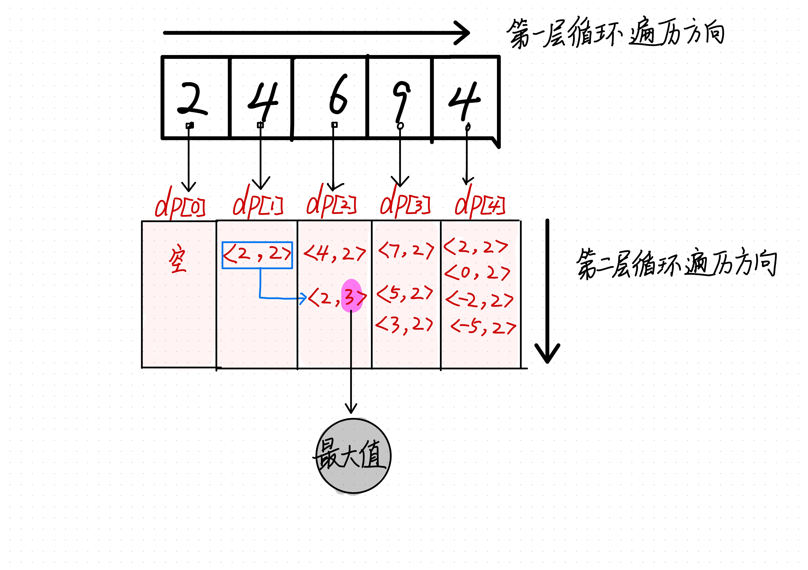

# 最长等差子序列

## 题目

给定一个整数数组 A，返回 A 中最长等差子序列的长度。

回想一下，A 的子序列是列表 A[i_1], A[i_2], ..., A[i_k] 其中 0 <= i_1 < i_2 < ... < i_k <= A.length - 1。并且如果 B[i+1] - B[i]( 0 <= i < B.length - 1) 的值都相同，那么序列 B 是等差的。

```python
输入：[3,6,9,12]
输出：4
解释：
整个数组是公差为 3 的等差数列。


输入：[9,4,7,2,10]
输出：3
解释：
最长的等差子序列是 [4,7,10]。
```

## 解法

- 动态规划问题
  - 状态：第i个数
  - 最优子结构：设dp[i]保存着以i结束，等差值为x的字典？
  - 转移方程：dp[i] = {}



